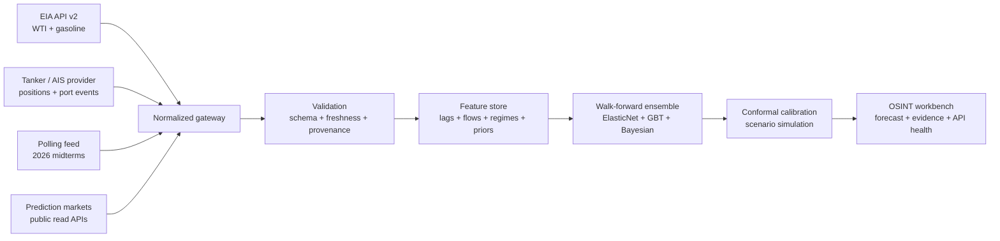

# StraitSignal

**Explainable oil-futures intelligence from tanker movements, U.S. fuel prices, election polling, and prediction markets.**

StraitSignal is a portfolio-grade OSINT and data-science project for studying how physical oil flows, consumer-price transmission, political-risk scenarios, and market-implied probabilities can contribute to an auditable WTI forecast. It is a research system, not a trading bot.

## What makes it different

- A real MapLibre/OpenStreetMap world map plots provider-supplied tanker coordinates and exposes the upstream position timestamp; stale public data is never labeled live.
- A tanker-flow layer treats chokepoint throughput, congestion, AIS gaps, port calls, and estimated laden state as physical-market features.
- The energy layer extends a 32-week WTI/PADD gasoline comparison with an 8-week distributed-lag pump-price forecast, regional dispersion, and asymmetric pass-through analysis.
- The political layer combines a documented polling adapter and prediction-market priors with a clearly separated oil/conflict stress projection for the 2026 U.S. midterms.
- The forecast lab compares regularized regression, gradient boosting, Bayesian regression, VAR/lead-lag diagnostics, conformal intervals, and Monte Carlo scenarios.
- The UI exposes source health, demo/live state, feature contribution, model disagreement, and uncertainty instead of hiding them behind a single number.

## System map



## Quick start

Requires Node.js 22+ and pnpm.

```bash
pnpm install
copy .env.example .env.local
pnpm dev
```

Open `http://localhost:3000`. With no keys, deterministic model panels remain clearly labeled demo data while the map requests the public latest-available tanker feed. Add a free EIA key and a licensed tanker provider for fresher production data.

```bash
pnpm run lint
pnpm run build
node --test tests/rendered-html.test.mjs
```

## API configuration

Copy `.env.example` and configure only the providers you have:

```dotenv
EIA_API_KEY=
TANKER_API_URL=
TANKER_API_KEY=
POLLING_API_URL=
```

The browser never receives these credentials. See [docs/API.md](docs/API.md) for normalized contracts, failure behavior, and provider-adapter guidance.

## Reproducible analysis

```bash
python -m venv .venv
python -m pip install -r requirements.txt
python analysis/train.py
python analysis/diagnostics.py
```

The default run uses deterministic synthetic data so CI can exercise the full walk-forward pipeline without pretending it is a market forecast. Provide a normalized CSV or parquet table to train on licensed data. See [docs/METHODOLOGY.md](docs/METHODOLOGY.md).

## Data sources and inspiration

- [U.S. EIA API v2](https://www.eia.gov/opendata/documentation.php) for energy data and [EIA weekly retail gasoline methodology](https://www.eia.gov/petroleum/gasdiesel/gas_proc-methods.php).
- [Polymarket public APIs](https://docs.polymarket.com/api-reference/introduction) for read-only market discovery and pricing.
- Configurable commercial tanker/AIS adapters, with documentation examples from [Kpler](https://developers.kpler.com/api/overview) and [VesselTrack](https://www.vesseltrack.net/api-docs).
- [OpenFreeMap](https://openfreemap.org/) and [MapLibre GL JS](https://maplibre.org/maplibre-gl-js/docs/) provide the real-world map without an exposed browser token.
- The supplied 32-week WTI/PADD reference analysis informed the rolling gasoline dispersion view.
- Polling is configured as a replaceable feed because publication terms and available APIs vary; the included July 2026 values are labeled as an illustrative snapshot, not a live poll average.

## Analytical cautions

- AIS silence can be benign; destination and cargo fields can be wrong.
- Polls and prediction markets are noisy, correlated, and not causal oil-price variables.
- The election stress projection is a bounded sensitivity model, not a substitute for a poll average or a causal claim about voter behavior.
- WTI spot data is not a roll-adjusted continuous futures series.
- Walk-forward performance can decay under new regimes.
- A calibrated interval is not a guarantee.
- Nothing here is financial advice or an offer to trade.

## Repository guide

| Path | Purpose |
|---|---|
| `app/page.tsx` | Interactive OSINT dashboard and scenario workbench. |
| `app/api/intel/route.ts` | Key-safe provider orchestration and labeled fallbacks. |
| `lib/intel.ts` | Normalized intelligence contract and deterministic demo snapshot. |
| `analysis/` | Feature engineering, walk-forward training, conformal calibration, and diagnostics. |
| `docs/API.md` | Adapter contracts and API-management guidance. |
| `docs/METHODOLOGY.md` | Modeling assumptions, evaluation, and limitations. |
| `PRODUCT.md` / `DESIGN.md` | Durable product and visual-system decisions. |

## License

MIT. Provider data remains subject to its own license and redistribution terms.
